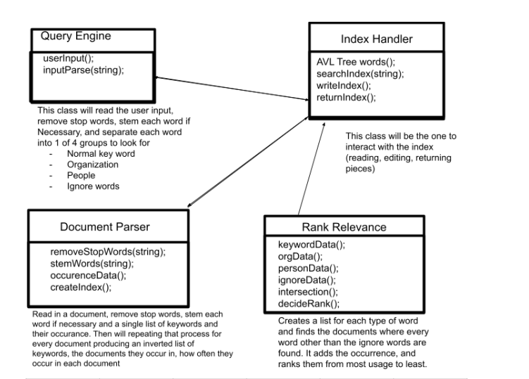

# Assignment 4: Search Engine
### by Son Phan and John Rydberg

## High-level Design of Solution

- UML class diagram, etc.
- 
- High-level pseudo code for each component.
  - *Pseudo code for document parser*:
    - readOneFile();
      - Get the data from the 1 jason file -> stem, remove stop word -> push it into trees
    - readAllFile();
      - Do the same steps for all the files that end with ".json"
  - *Pseudo code for index handler*:
    - insertFunction();
      - creating insert functions so that words from the document parser to push into trees
    - writeFunction();
      - write all the information from trees to ".txt" files
    - readFunction();
      - push the information from the files into the trees
  - *Pseudo code for query processor*:
      - takingInput(string);
        - take the query from the user that remove stop word, stem it and push it into vectors which then be used for relevancy ranking
  - *Pseudo code for relevancy ranking*:
    - sortingFunction();
      - take the data from the vectors of the query then compare it with the trees to take out the documents that have the most relevance
  - *Pseudo code for user interface*:
    - loadUserInterface();
      - this will load up a menu with option so that the user can choose what to go for or exit the search program
  

## Your Timeline to Finish the Project
Weekly milestones/tasks. Set out a plan at the beginning and then record when you got it done.

| Task                    | Planned completion | Actual completion | Time spent in hrs by John | Time spent in hrs by Son |
|-------------------------|:------------------:|:-----------------:|:-------------------------:|:------------------------:|
| Avl Tree                |       Nov 5        |       Nov 6       |             5             |            3             |              
| Document Parser         |       Nov 14       |      Nov 17       |            0.5            |            5             |
| Index Handler           |       Nov 17       |      Nov 21       |            4.5            |           0.5            |
| Query Processor         |       Nov 25       |      Nov 29       |            0.5            |            5             |
| User Interface          |       Nov 25       |      Nov 29       |             3             |            5             |
| Persistence algorithm   |       Dec 1        |       Dec 4       |             6             |           0.5            |
| Testing + Final Touches |       Dec 2        |       Dec 4       |             5             |            5             |


## Used Data Structures
Explanation of what data structures are used where. For each, state
- time and space complexity (Big-Oh),
  - AVL tree: log(n)
    - Index Handler directly access to the AVL tree. All other classes access AVL tree through the index handler
  - unordered_map: O(1)
    - map is being used as a node in the AVL trees (which is created in the Index Handler)
  - unordered_set: O(1)
    - set is used to read the stop word file 
  - vector: O(n)
    - vector is used to store all the aritcle information
- why it is the appropriate data structure and what other data structure could have been used.
  - Because using map can reduce the big-oh by a lot 
  - Using an AVL tree is the best way to sort all the words from files and to find them
  

## User Documentation
- How to use the software:
  - There are 7 options for user to choose from:
    - Option1: create the index
      - Parse all the documents and push it into the tree
    - Option2: write the persistence file
      - Write the information of the AVL tree into files
    - Option3: read the persistence file
      - Read the information of persistence files
    - Option4: search up the keywords
      - Input keyword into the query
      - Normal words, PERSON: (for person), ORG: (for organizations), - (to ignore words)
      - For organization and person, the user can include the whole name by using '+'
    - Option5: output the statistic for the program
      - Show the running time for the indexing and the file searching
    - Option6: clear the index
      - Clear the information in the AVL tree
    - Option7: exit the program
  
- Some example queries with the results.
```asm
Enter Query:interesting
  interesting
1. Title: Cramer remains confident on most major banks after earnings Site: www.cnbc.com Date: 2018-01-18T01:25:00.000+02:00
2. Title: Interest rates shoot higher amid worries the central bank easy money party is over Site: www.cnbc.com Date: 2018-01-09T23:40:00.000+02:00
3. Title: Credit card debt hits record high of over $1 trillion—but one trick can save you thousands Site: www.cnbc.com Date: 2018-01-09T18:16:00.000+02:00
4. Title: Cramer prepares investors for the big banks' Friday earnings reports Site: www.cnbc.com Date: 2018-01-12T01:34:00.000+02:00
5. Title: J&J attracts Chinese interest for its diabetes business in a potential $3B to $4B deal Site: www.cnbc.com Date: 2018-01-17T14:23:00.000+02:00
6. Title: Bonds entering the ‘danger zone,’ market watcher says Site: www.cnbc.com Date: 2018-01-12T19:55:00.000+02:00
7. Title: How Democrats can neutralize GOP tax law Site: www.cnbc.com Date: 2018-01-17T21:24:00.000+02:00
8. Title: 85 percent of millennials expect to own a home—here's how to buy one Site: www.cnbc.com Date: 2018-01-09T22:00:00.000+02:00
9. Title: Why Wall Street Is Ignoring “CAPE” Fear Site: fortune.com Date: 2018-01-17T02:18:00.000+02:00
10. Title: Mortgage applications shoot up 8.3% to start the year Site: www.cnbc.com Date: 2018-01-10T14:00:00.000+02:00
11. Title: Bank of America posts earnings beat, excluding tax charge Site: www.cnbc.com Date: 2018-01-17T13:25:00.000+02:00
12. Title: With tax law not positive for housing, top analyst finds value away from homebuilders Site: www.cnbc.com Date: 2018-01-03T23:11:00.000+02:00
13. Title: EMERGING MARKETS-Latam currencies, stocks rally at start of 2018 Site: www.cnbc.com Date: 2018-01-03T00:07:00.000+02:00
14. Title: Wells Fargo beats earnings estimates but just misses on revenue; shares fall more than 1% Site: www.cnbc.com Date: 2018-01-12T15:00:00.000+02:00
15. Title: Johnson & Johnson trying to sell its diabetes care business to Chinese buyers for up to $4 billion Site: www.cnbc.com Date: 2018-01-17T20:28:00.000+02:00

Choose a file you want to look into (1-15) or hit 0 to continue searching:
4
Friday marks the unofficial start of earnings season, with big banks J.P. Morgan , Wells Fargo and PNC Financial reporting their quarterly numbers.
But CNBC's Jim Cramer knows the fourth quarter tends to be "messier" for financial companies, so he wanted to make sure investors were prepared for the big day.
...

```
```asm
Enter Query:ORG:reuters
  ORG:reuters
1. Title: Suicide attack in Baghdad kills at least 16, wounds 65: ministry says Site: www.reuters.com Date: 2018-01-15T08:17:00.000+02:00
2. Title: UPDATE 2-Brazil's Petrobras settles U.S. corruption class action for $2.95 bln Site: www.cnbc.com Date: 2018-01-03T17:07:00.000+02:00
3. Title: US lawmakers urge AT&T to cut commercial ties with Huawei: Reuters Site: www.cnbc.com Date: 2018-01-16T09:21:00.000+02:00
4. Title: World food prices fall 3.3 pct in December - UN FAO Site: www.cnbc.com Date: 2018-01-11T11:15:00.000+02:00
5. Title: A US Senator wants an answer from Apple on slowing down batteries Site: www.cnbc.com Date: 2018-01-10T16:00:00.000+02:00
6. Title: U.S. lifts ban on pork imports from Mexico Site: www.cnbc.com Date: 2018-01-13T02:13:00.000+02:00
7. Title: IBM shares rise after Barclays double upgrade Site: www.reuters.com Date: 2018-01-17T15:21:00.000+02:00
8. Title: VATICAN: 'HARSH AND OFFENSIVE'... Site: www.reuters.com Date: 2018-01-12T20:31:00.000+02:00
...
```
```asm
Enter Query:PERSON:carolyn+julie+fairbairn
  PERSON:carolyn+julie+fairbairn
1. Title: German firms doing business in UK gloomy about Brexit - survey Site: www.reuters.com Date: 2018-02-27T20:09:00.000+02:00

```
## Performance
- Statistics for indexing all documents and timing.
```asm
Creating the index time: 55.7963
Searching time: 9.4415e-05
Number of articles: 1303
```

